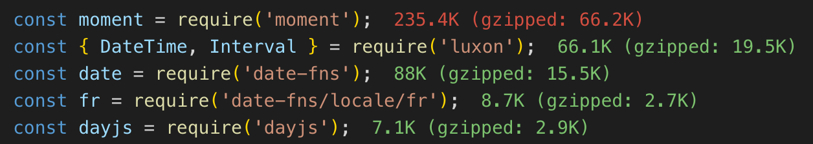

# [You don't (may not) need Moment.js](https://you-dont-need.github.io/You-Dont-Need-Momentjs/#/)

[](https://dev.to/t/momentjs)

[Moment.js](https://momentjs.com/) is a fantastic time & date library with lots of great features and utilities. However, if you are working on a performance sensitive web application, it might cause a huge performance overhead because of its complex APIs and large bundle size.



Problems with Moment.js:

- It is highly based on OOP APIs, which makes it fail to work with tree-shaking, thus leading to a huge bundle size and performance issues.
- It is mutable and it causes bugs:
  - [clone](https://momentjs.com/docs/#/parsing/moment-clone/)
  - [How do I work around mutability in moment.js?](https://stackoverflow.com/questions/30979178/how-do-i-work-around-mutability-in-moment-js)
- Complex OOP API (which doubles mutability problem). Here is an example:
  https://github.com/moment/moment/blob/develop/src/test/moment/add_subtract.js#L244-L286
  Moment.js allows to use `a.subtract('ms', 50)`, `a.subtract(50, 'ms')` and even `a.subtract('s', '50')`.

If you are not using timezone but only a few simple functions from moment.js, this might bloat your app, and therefore is considered overkill. [dayjs](https://github.com/iamkun/dayjs) has a smaller core and has very similar APIs so it makes it very easy to migrate. [date-fns](https://github.com/date-fns/date-fns) enables [tree-shaking and other benefits](https://github.com/date-fns/date-fns/issues/275#issuecomment-264934189) so that it works great with React, Sinon.js, and webpack, etc. See https://github.com/moment/moment/issues/2373 for more ideas on why and how people switch from moment.js to other solutions.

## Brief Comparison

| Name      | Tree-shaking | Methods richness | Pattern    | Locale | Timezone Support       | Popularity (stars)                                               | Sizes                                                                                                                        |
| --------- | ------------ | ---------------- | ---------- | ------ | ---------------------- | ---------------------------------------------------------------- | ---------------------------------------------------------------------------------------------------------------------------- |
| Moment.js | No           | High             | OO         | 123    | Good (moment-timezone) |      |       |
| Luxon     | No           | High             | OO         | -      | Good (Intl)            |       |         |
| date-fns  | Yes          | High             | Functional | 64     | Good (date-fns-tz)     |  |   |
| dayjs     | No           | High             | OO         | 138    | Good (Intl)            |       |         |

## Voice of Developers

> [Removed moment.js to replace with date-fns - build output reduced by 40%](https://github.com/oysterprotocol/webnode/pull/116)

> &mdash;<cite>Jared Farago from [webnode](https://github.com/oysterprotocol/webnode/pull/116) project.</cite>

> [Good library if you’re looking to replace Moment.js for one reason or another. Immutable too.](https://twitter.com/dan_abramov/status/805030922785525760)

> &mdash;<cite>Dan Abramov, Author of [Redux](https://github.com/reduxjs/redux) and co-author of [Create React App](https://github.com/facebook/create-react-app). Building tools for humans.</cite>

> [I strongly recommend using date-fns over Moment.js, it's has a nicer API and you can include only parts you need!](https://twitter.com/silvenon/status/804946772690923520)

> &mdash;<cite>Matija Marohnić, a design-savvy frontend developer from Croatia.</cite>

## ESLint Plugin

<p align="center">
  <a href="https://www.npmjs.com/package/eslint-plugin-you-dont-need-momentjs">
    
  </a>
  <a href="https://www.npmjs.org/package/eslint-plugin-you-dont-need-momentjs">
    
  </a>
  <a href="https://travis-ci.org/you-dont-need/You-Dont-Need-Momentjs">
    
  </a>
  <a href="https://coveralls.io/github/you-dont-need/You-Dont-Need-Momentjs?branch=master">
    
  </a>
</p>

If you're using [ESLint](http://eslint.org/), you can install a
[plugin](http://eslint.org/docs/user-guide/configuring#using-the-configuration-from-a-plugin) that
will help you identify places in your codebase where you don't (may not) need Moment.js.

Install the plugin...

```sh
npm install --save-dev eslint-plugin-you-dont-need-momentjs
```

...then update your config

```js
"extends" : ["plugin:you-dont-need-momentjs/recommended"],
```

## Quick Links

**[Parse](#parse)**

1. [String + Date Format](#string--date-format)
1. [String + Time Format](#string--time-format)
1. [String + Format + locale](#string--format--locale)

**[Get + Set](#get--set)**

1. [Millisecond/Second/Minute/Hour](#millisecond--second--minute--hour)
1. [Date of Month](#date-of-month)
1. [Day of Week](#day-of-week)
1. [Day of Year](#day-of-year)
1. [Week of Year](#week-of-year)
1. [Days in Month](#days-in-month)
1. [Weeks in Year](#weeks-in-year)
1. [Maximum of the given dates](#maximum-of-the-given-dates)
1. [Minimum of the given dates](#minimum-of-the-given-dates)

**[Manipulate](#manipulate)**

1. [Add](#add)
1. [Subtract](#subtract)
1. [Start of Time](#start-of-time)
1. [End of Time](#end-of-time)

**[Display](#display)**

1. [Format](#format)
1. [Time from now](#time-from-now)
1. [Time from X](#time-from-x)
1. [Difference](#difference)

**[Query](#query)**

1. [Is Before](#is-before)
1. [Is Same](#is-same)
1. [Is After](#is-after)
1. [Is Between](#is-between)
1. [Is Leap Year](#is-leap-year)
1. [Is a Date](#is-a-date)

# Feature Parity

⚠️ Indicates other packages or work are needed. See individual functions [above](#quick-links).

|                                | Native | Luxon | date-fns | dayjs | Temporal |
| ------------------------------ | ------ | ----- | -------- | ----- | -------- |
| **Parse**                      |        |       |          |       |          |
| String + Date Format           | ✅     | ✅     | ✅       | ✅    | ✅         |
| String + Time Format           | ✅     | ✅     | ✅       | ⚠️    | ✅        |
| String + Format + locale       | ❌     | ⚠️     | ✅       | ⚠️    | ❌        |
|                                |        |       |          |       |          |
| **Get + Set**                  |        |       |          |       |          |
| Millisecond/Second/Minute/Hour | ✅     | ✅    | ✅       | ✅    | ✅        |
| Date of Month                  | ✅     | ✅    | ✅       | ✅    | ✅        |
| Day of Week                    | ✅     | ✅    | ✅       | ✅    | ✅        |
| Day of Year                    | ✅     | ✅    | ✅       | ✅    | ✅        |
| Week of Year                   | ✅     | ✅    | ✅       | ⚠️    | ✅        |
| Days in Month                  | ✅     | ✅    | ✅       | ✅    | ✅        |
| Weeks in Year                  | ❌     | ❌    | ✅       | ⚠️    | ✅        |
| Maximum of the given dates     | ✅     | ✅    | ✅       | ⚠️    | ✅        |
| Minimum of the given dates     | ✅     | ✅    | ✅       | ⚠️    | ✅        |
|                                |        |       |          |       |          |
| **Manipulate**                 |        |       |          |       |          |
| Add                            | ✅     | ✅    | ✅       | ✅    | ✅        |
| Subtract                       | ✅     | ✅    | ✅       | ✅    | ✅        |
| Start of Time                  | ❌     | ✅    | ✅       | ✅    | ✅        |
| End of Time                    | ✅     | ✅    | ✅       | ✅    | ✅        |
|                                |        |       |          |       |          |
| **Display**                    |        |       |          |       |          |
| Format                         | ✅     | ✅    | ✅       | ✅    | ✅        |
| Time from now                  | ✅     | ❌    | ✅       | ⚠️    | ✅        |
| Time from X                    | ❌     | ❌    | ✅       | ⚠️    | ✅        |
| Difference                     | ✅     | ✅    | ✅       | ✅    | ✅        |
|                                |        |       |          |       |          |
| **Query**                      |        |       |          |       |          |
| Is Before                      | ✅     | ✅    | ✅       | ✅    | ✅        |
| Is Same                        | ✅     | ✅    | ✅       | ✅    | ✅        |
| Is After                       | ✅     | ✅    | ✅       | ✅    | ✅        |
| Is Between                     | ❌     | ✅    | ✅       | ⚠️    | ❌        |
| Is Leap Year                   | ✅     | ✅    | ✅       | ⚠️    | ✅        |
| Is a Date                      | ✅     | ✅    | ✅       | ✅    | ✅        |

## Parse

### String + Date Format

Return the date parsed from date string using the given format string.

```js
// Moment.js
moment('12-25-1995', 'MM-DD-YYYY');
// => "1995-12-24T13:00:00.000Z"

// Native
const datePattern = /^(\d{2})-(\d{2})-(\d{4})$/;
const [, month, day, year] = datePattern.exec('12-25-1995');
new Date(`${month}, ${day} ${year}`);
// => "1995-12-24T13:00:00.000Z"

// date-fns
import parse from 'date-fns/parse';
parse('12-25-1995', 'MM-dd-yyyy', new Date());
// => "1995-12-24T13:00:00.000Z"

// dayjs
dayjs('12-25-1995');
// => "1995-12-24T13:00:00.000Z"

// luxon
DateTime.fromFormat('12-25-1995', 'MM-dd-yyyy').toJSDate();
// => "1995-12-24T13:00:00.000Z"

// Temporal
const datePattern = /^(\d{2})-(\d{2})-(\d{4})$/;
const [, month, day, year] = datePattern.exec('12-25-1995');
new Temporal.ZonedDateTime.from({year, month, day, timeZone: Temporal.Now.timeZone()});
// => "1995-12-24T13:00:00.000Z"
```

**[⬆ back to top](#quick-links)**

### String + Time Format

Return the date parsed from time string using the given format string.

```js
// Moment.js
moment('2010-10-20 4:30', 'YYYY-MM-DD HH:mm');
// => "2010-10-19T17:30:00.000Z"

// Native
const datePattern = /^(\d{4})-(\d{2})-(\d{2})\s(\d{1,2}):(\d{2})$/;
const [, year, month, day, rawHour, min] = datePattern.exec('2010-10-20 4:30');
new Date(`${year}-${month}-${day}T${('0' + rawHour).slice(-2)}:${min}:00`);
// => "2010-10-19T17:30:00.000Z"

// date-fns
import parse from 'date-fns/parse';
parse('2010-10-20 4:30', 'yyyy-MM-dd H:mm', new Date());
// => "2010-10-19T17:30:00.000Z"

// dayjs ⚠️ requires customParseFormat plugin
import customParseFormat from 'dayjs/plugin/customParseFormat';
dayjs.extend(customParseFormat);
dayjs('2010-10-20 4:30', 'YYYY-MM-DD HH:mm');
// => "2010-10-19T17:30:00.000Z"

// luxon
DateTime.fromFormat('2010-10-20 4:30', 'yyyy-MM-dd H:mm').toJSDate();
// => "2010-10-19T17:30:00.000Z"

// Temporal
const datePattern = /^(\d{4})-(\d{2})-(\d{2})\s(\d{1,2}):(\d{2})$/;
const [, year, month, day, hour, minute] = datePattern.exec('2010-10-20 4:30');
new Temporal.ZonedDateTime.from({year, month, day, hour, minute, timeZone: Temporal.Now.timeZone()});
// => "2010-10-19T17:30:00.000Z"
```

**[⬆ back to top](#quick-links)**

### String + Format + locale

Return the date parsed from string using the given format string and locale.

```js
// Moment.js
moment('2012 mars', 'YYYY MMM', 'fr');
// => "2012-02-29T13:00:00.000Z"

// date-fns
import parse from 'date-fns/parse';
import fr from 'date-fns/locale/fr';
parse('2012 mars', 'yyyy MMMM', new Date(), { locale: fr });
// => "2012-02-29T13:00:00.000Z"

// dayjs ⚠️ requires customParseFormat plugin
import customParseFormat from 'dayjs/plugin/customParseFormat';
import 'dayjs/locale/fr';
dayjs.extend(customParseFormat);
dayjs('2012 mars', 'YYYY MMM', 'fr');
// => "2012-02-29T13:00:00.000Z"

// Luxon ❌ does not support Locale for node unless https://moment.github.io/luxon/docs/manual/install.html#node
DateTime.fromFormat('2012 mars', 'yyyy MMMM', { locale: 'fr' });
// => "2012-02-29T13:00:00.000Z"
```

**[⬆ back to top](#quick-links)**

## Get + Set

### Millisecond / Second / Minute / Hour

Get the `Millisecond/Second/Minute/Hour` of the given date.

```js
// Moment.js
moment().seconds();
// => 49
moment().hours();
// => 19

// Native
new Date().getSeconds();
// => 49
new Date().getHours();
// => 19

// date-fns
import getSeconds from 'date-fns/getSeconds';
import getHours from 'date-fns/getHours';
getSeconds(new Date());
// => 49
getHours(new Date());
// => 19

// dayjs
dayjs().second();
// => 49
dayjs().hour();
// => 19

// Luxon
DateTime.local().second;
// => 49
DateTime.local().hour;
// => 19

// Temporal
Temporal.Now.zonedDateTimeISO().second;
// => 49
Temporal.Now.zonedDateTimeISO().hour;
// => 19
```

### Performance tests

| Library  | Time       |
| -------- | ---------- |
| Moment   | 1500.703ms |
| Native   | 348.411ms  |
| DateFns  | 520.670ms  |
| DayJs    | 494.234ms  |
| Luxon    | 1208.368ms |
| Temporal | -          |

Set the `Millisecond/Second/Minute/Hour` of the given date.

```js
// Moment.js
moment().seconds(30);
// => "2018-09-09T09:12:30.695Z"
moment().hours(13);
// => "2018-09-09T03:12:49.695Z"

// Native
new Date(new Date().setSeconds(30));
// => "2018-09-09T09:12:30.695Z"
new Date(new Date().setHours(13));
// => "2018-09-09T03:12:49.695Z"

// date-fns
import setSeconds from 'date-fns/setSeconds';
import setHours from 'date-fns/setHours';
setSeconds(new Date(), 30);
// => "2018-09-09T09:12:30.695Z"
setHours(new Date(), 13);
// => "2018-09-09T03:12:49.695Z"

// dayjs
dayjs().set('second', 30);
// => "2018-09-09T09:12:30.695Z"
dayjs().set('hour', 13);
// => "2018-09-09T03:12:49.695Z"

// luxon
DateTime.utc()
  .set({ second: 30 })
  .toJSDate();
// => "2018-09-09T09:12:30.695Z"
DateTime.utc()
  .set({ hour: 13 })
  .toJSDate();
// => "2018-09-09T03:12:49.695Z"

// Temporal
Temporal.Now.zonedDateTimeISO().with({ second: 30 });
// => "2018-09-09T09:12:30.695Z"
Temporal.Now.zonedDateTimeISO().with({ hour: 13 });
// => "2018-09-09T03:12:49.695Z"
```

### Performance tests

| Library  | Time       |
| -------- | ---------- |
| Moment   | 1689.744ms |
| Native   | 636.741ms  |
| DateFns  | 714.148ms  |
| DayJs    | 2037.603ms |
| Luxon    | 2897.571ms |
| Temporal | -          |

**[⬆ back to top](#quick-links)**

### Date of Month

Gets or sets the day of the month.

```js
// Moment.js
moment().date();
// => 9
moment().date(4);
// => "2018-09-04T09:12:49.695Z"

// Native
new Date().getDate();
// => 9
new Date().setDate(4);
// => "2018-09-04T09:12:49.695Z"

// date-fns
import getDate from 'date-fns/getDate';
import setDate from 'date-fns/setDate';
getDate(new Date());
// => 9
setDate(new Date(), 4);
// => "2018-09-04T09:12:49.695Z"

// dayjs
dayjs().date();
// => 9
dayjs().set('date', 4);
// => "2018-09-04T09:12:49.695Z"

// luxon
DateTime.utc().day;
// => 9
DateTime.utc()
  .set({ day: 4 })
  .toString();
// => "2018-09-04T09:12:49.695Z"

// Temporal
Temporal.Now.zonedDateTimeISO().day;
// => 9
Temporal.Now.zonedDateTimeISO().with({ day: 4 });
// => "2018-09-04T09:12:49.695Z"
```

### Performance tests

| Library  | Time       |
| -------- | ---------- |
| Moment   | 1381.669ms |
| Native   | 397.415ms  |
| DateFns  | 588.004ms  |
| DayJs    | 1218.025ms |
| Luxon    | 2705.606ms |
| Temporal | -          |

**[⬆ back to top](#quick-links)**

### Day of Week

Gets or sets the day of the week.

```js
// Moment.js
moment().day();
// => 0 (Sunday)
moment().day(-14);
// => "2018-08-26T09:12:49.695Z"

// Native
new Date().getDay();
// => 0 (Sunday)
new Date().setDate(new Date().getDate() - 14);
// => "2018-08-26T09:12:49.695Z"

// date-fns
import getDay from 'date-fns/getDay';
import setDay from 'date-fns/setDay';
getDay(new Date());
// => 0 (Sunday)
setDay(new Date(), -14);
// => "2018-08-26T09:12:49.695Z"

// dayjs
dayjs().day();
// => 0 (Sunday)
dayjs().set('day', -14);
// => "2018-08-26T09:12:49.695Z"

// Luxon
DateTime.local().weekday;
// => 7 (Sunday)
DateTime.local()
  .minus({ day: 14 })
  .toJSDate();
// => "2018-08-26T09:12:49.695Z"

// Temporal
Temporal.Now.zonedDateTimeISO().dayOfWeek;
// => 7 (Sunday)
Temporal.Now.zonedDateTimeISO().subtract(Temporal.Duration.from({ days: 14 }));
// => "2018-09-04T09:12:49.695Z"
```

| Library  | Time       |
| -------- | ---------- |
| Moment   | 1919.404ms |
| Native   | 543.466ms  |
| DateFns  | 841.436ms  |
| DayJs    | 1229.475ms |
| Luxon    | 3936.282ms |
| Temporal | -          |

**[⬆ back to top](#quick-links)**

### Day of Year

Gets or sets the day of the year.

```js
// Moment.js
moment().dayOfYear();
// => 252
moment().dayOfYear(256);
// => "2018-09-13T09:12:49.695Z"

// Native
Math.floor(
  (new Date() - new Date(new Date().getFullYear(), 0, 0)) / 1000 / 60 / 60 / 24
);
// => 252

// date-fns
import getDayOfYear from 'date-fns/getDayOfYear';
import setDayOfYear from 'date-fns/setDayOfYear';
getDayOfYear(new Date());
// => 252
setDayOfYear(new Date(), 256);
// => "2018-09-13T09:12:49.695Z"

// dayjs ⚠️ requires dayOfYear plugin
import dayOfYear from 'dayjs/plugin/dayOfYear';
dayjs.extend(dayOfYear);
dayjs().dayOfYear();
// => 252
dayjs().dayOfYear(256);
// => "2018-09-13T09:12:49.695Z"

// Luxon
DateTime.local().ordinal;
// => 252
DateTime.local()
  .set({ ordinal: 256 })
  .toString();
// => "2018-09-13T09:12:49.695Z"

// Temporal
Temporal.Now.zonedDateTimeISO().dayOfYear;
// => 252
Temporal.Now.zonedDateTimeISO().with({month: 1, day: 1}).add(Temporal.Duration.from({days: 256}));
// => "2018-09-04T09:12:49.695Z"
```

| Library  | Time       |
| -------- | ---------- |
| Moment   | 5511.172ms |
| Native   | 530.592ms  |
| DateFns  | 2079.043ms |
| DayJs    | -          |
| Luxon    | 3540.810ms |
| Temporal | -          |

**[⬆ back to top](#quick-links)**

### Week of Year

Gets or sets the week of the year.

```js
// Moment.js
moment().week();
// => 37
moment().week(24);
// => "2018-06-10T09:12:49.695Z"

// date-fns
import getWeek from 'date-fns/getWeek';
import setWeek from 'date-fns/setWeek';
getWeek(new Date());
// => 37
setWeek(new Date(), 24);
// => "2018-06-10T09:12:49.695Z"

// native getWeek
const day = new Date();
const MILLISECONDS_IN_WEEK = 604800000;
const firstDayOfWeek = 1; // monday as the first day (0 = sunday)
const startOfYear = new Date(day.getFullYear(), 0, 1);
startOfYear.setDate(
  startOfYear.getDate() + (firstDayOfWeek - (startOfYear.getDay() % 7))
);
const dayWeek = Math.round((day - startOfYear) / MILLISECONDS_IN_WEEK) + 1;
// => 37

// native setWeek
const day = new Date();
const week = 24;
const MILLISECONDS_IN_WEEK = 604800000;
const firstDayOfWeek = 1; // monday as the first day (0 = sunday)
const startOfYear = new Date(day.getFullYear(), 0, 1);
startOfYear.setDate(
  startOfYear.getDate() + (firstDayOfWeek - (startOfYear.getDay() % 7))
);
const dayWeek = Math.round((day - startOfYear) / MILLISECONDS_IN_WEEK) + 1;
day.setDate(day.getDate() - (dayWeek - week) * 7);
day.toISOString();
// => "2018-06-10T09:12:49.794Z

// dayjs ⚠️ requires weekOfYear plugin
import weekOfYear from 'dayjs/plugin/weekOfYear';
dayjs.extend(weekOfYear);
dayjs().week();
// => 37
dayjs().week(24);
// => "2018-06-10T09:12:49.695Z"

// Luxon
DateTime.local().weekNumber;
// => 37
DateTime.local()
  .set({ weekNumber: 23 })
  .toString();
// => "2018-06-10T09:12:49.794Z

// Temporal
Temporal.Now.zonedDateTimeISO().weekOfYear;
// => 252
Temporal.Now.zonedDateTimeISO().with({month: 1, day: 1}).add(Temporal.Duration.from({weeks: 23}));
// => "2018-09-04T09:12:49.695Z"
```

| Library  | Time       |
| -------- | ---------- |
| Moment   | 7147.201ms |
| Native   | 1371.631ms |
| DateFns  | 5834.815ms |
| DayJs    | -          |
| Luxon    | 4514.771ms |
| Temporal | -          |

**[⬆ back to top](#quick-links)**

### Days in Month

Get the number of days in the current month.

```js
// Moment.js
moment('2012-02', 'YYYY-MM').daysInMonth();
// => 29

// Native
new Date(2012, 02, 0).getDate();
// => 29

// date-fns
import getDaysInMonth from 'date-fns/getDaysInMonth';
getDaysInMonth(new Date(2012, 1));
// => 29

// dayjs
dayjs('2012-02').daysInMonth();
// => 29

// Luxon
DateTime.local(2012, 2).daysInMonth;
// => 29

// Temporal
(new Temporal.PlainYearMonth(2012, 2)).daysInMonth
// or
Temporal.PlainYearMonth.from('2012-02').daysInMonth
// => 29
```

| Library  | Time       |
| -------- | ---------- |
| Moment   | 4415.065ms |
| Native   | 186.196ms  |
| DateFns  | 634.084ms  |
| DayJs    | 1922.774ms |
| Luxon    | 1403.032ms |
| Temporal | -          |

**[⬆ back to top](#quick-links)**

### Weeks in Year

Gets the number of weeks in the current year, according to ISO weeks.

```js
// Moment.js
moment().isoWeeksInYear();
// => 52

// date-fns
import getISOWeeksInYear from 'date-fns/getISOWeeksInYear';
getISOWeeksInYear(new Date());
// => 52

// dayjs ⚠️ requires isoWeeksInYear plugin
import isoWeeksInYear from 'dayjs/plugin/isoWeeksInYear';
dayjs.extend(isoWeeksInYear);
dayjs().isoWeeksInYear();
// => 52

// Luxon
DateTime.local().weeksInWeekYear;
// => 52

// Temporal
Temporal.PlainDate.from({day:31, month:12, year: Temporal.Now.plainDateISO()}).weekOfYear
// => 52
```

| Library  | Time       |
| -------- | ---------- |
| Moment   | 1065.247ms |
| Native   | -          |
| DateFns  | 4954.042ms |
| DayJs    | -          |
| Luxon    | 1134.483ms |
| Temporal | -          |

**[⬆ back to top](#quick-links)**

### Maximum of the given dates

Returns the maximum (most distant future) of the given date.

```js
const array = [
  new Date(2017, 4, 13),
  new Date(2018, 2, 12),
  new Date(2016, 0, 10),
  new Date(2016, 0, 9),
];
// Moment.js
moment.max(array.map(a => moment(a)));
// => "2018-03-11T13:00:00.000Z"

// Native
new Date(Math.max.apply(null, array)).toISOString();
// => "2018-03-11T13:00:00.000Z"

// date-fns
import max from 'date-fns/max';
max(array);
// => "2018-03-11T13:00:00.000Z"

// dayjs ⚠️ requires minMax plugin
import minMax from 'dayjs/plugin/minMax';
dayjs.extend(minMax);
dayjs.max(array.map(a => dayjs(a)));
// => "2018-03-11T13:00:00.000Z"

// Luxon
DateTime.max(...array.map(a => DateTime.fromJSDate(a))).toJSDate();
// => "2018-03-11T13:00:00.000Z"

// Temporal
Temporal.Instant.fromEpochMilliseconds(Math.max.apply(null, array))
// => "2018-03-11T13:00:00.000Z"
```

| Library  | Time       |
| -------- | ---------- |
| Moment   | 1780.075ms |
| Native   | 828.332ms  |
| DateFns  | 980.938ms  |
| DayJs    | -          |
| Luxon    | 2694.702ms |
| Temporal | -          |

**[⬆ back to top](#quick-links)**

### Minimum of the given dates

Returns the minimum (most distant future) of the given date.

```js
const array = [
  new Date(2017, 4, 13),
  new Date(2018, 2, 12),
  new Date(2016, 0, 10),
  new Date(2016, 0, 9),
];
// Moment.js
moment.min(array.map(a => moment(a)));
// => "2016-01-08T13:00:00.000Z"

// Native
new Date(Math.min.apply(null, array)).toISOString();
// => "2016-01-08T13:00:00.000Z"

// date-fns
import min from 'date-fns/min';
min(array);
// => "2016-01-08T13:00:00.000Z"

// dayjs ⚠️ requires minMax plugin
import minMax from 'dayjs/plugin/minMax';
dayjs.extend(minMax);
dayjs.min(array.map(a => dayjs(a)));
// => "2016-01-08T13:00:00.000Z"

// Luxon
DateTime.min(...array.map(a => DateTime.fromJSDate(a))).toJSDate();
// => "2016-01-08T13:00:00.000Z"

// Temporal
Temporal.Instant.fromEpochMilliseconds(Math.min.apply(null, array))
// => "2018-03-11T13:00:00.000Z"
```

| Library  | Time       |
| -------- | ---------- |
| Moment   | 1744.459ms |
| Native   | 819.646ms  |
| DateFns  | 841.249ms  |
| DayJs    | -          |
| Luxon    | 2720.462ms |
| Temporal | -          |

**[⬆ back to top](#quick-links)**

## Manipulate

### Add

Add the specified number of days to the given date.

```js
// Moment.js
moment().add(7, 'days');
// => "2018-09-16T09:12:49.695Z"

// Native
const now = new Date();
now.setDate(now.getDate() + 7);
// => "Sun Sep 16 2018 09:12:49"

// date-fns
import addDays from 'date-fns/addDays';
addDays(new Date(), 7);
// => "2018-09-16T09:12:49.695Z"

// dayjs
dayjs().add(7, 'day');
// => "2018-09-16T09:12:49.695Z"

// Luxon
DateTime.local()
  .plus({ day: 7 })
  .toJSDate();
// => "2018-09-16T09:12:49.695Z"

// Temporal
Temporal.Now.zonedDateTimeISO().add(Temporal.Duration.from({days: 7}));
// => "2018-09-16T09:12:49.695Z"
```

| Library  | Time       |
| -------- | ---------- |
| Moment   | 1309.485ms |
| Native   | 259.932ms  |
| DateFns  | 385.394ms  |
| DayJs    | 1911.881ms |
| Luxon    | 3919.797ms |
| Temporal | -          |

**[⬆ back to top](#quick-links)**

### Subtract

Subtract the specified number of days from the given date.

```js
// Moment.js
moment().subtract(7, 'days');
// => "2018-09-02T09:12:49.695Z"

// Native
const now = new Date();
now.setDate(now.getDate() - 7);
// => Sun Sep 09 2018 09:12:49

// date-fns
import subDays from 'date-fns/subDays';
subDays(new Date(), 7);
// => "2018-09-02T09:12:49.695Z"

// dayjs
dayjs().subtract(7, 'day');
// => "2018-09-02T09:12:49.695Z"

// Luxon
DateTime.local()
  .minus({ day: 7 })
  .toJSDate();
// => "2018-09-02T09:12:49.695Z"

// Temporal
Temporal.Now.zonedDateTimeISO().subtract(Temporal.Duration.from({days: 7}));
// => "2018-09-02T09:12:49.695Z"
```

| Library  | Time       |
| -------- | ---------- |
| Moment   | 1278.384ms |
| Native   | 215.255ms  |
| DateFns  | 379.057ms  |
| DayJs    | 1772.593ms |
| Luxon    | 4028.866ms |
| Temporal | -          |

**[⬆ back to top](#quick-links)**

### Start of Time

Return the start of a unit of time for the given date.

```js
// Moment.js
moment().startOf('month');
// => "2018-08-31T14:00:00.000Z"

// date-fns
import startOfMonth from 'date-fns/startOfMonth';
startOfMonth(new Date());
// => "2018-08-31T14:00:00.000Z"

// dayjs
dayjs().startOf('month');
// => "2018-08-31T14:00:00.000Z"

// Luxon
DateTime.local().startOf('month');
// => "2018-09-02T09:12:49.695Z"

// Temporal
Temporal.Now.zonedDateTimeISO().with({day: 1});
// => "2018-09-01T14:00:00.000Z"
```

| Library  | Time       |
| -------- | ---------- |
| Moment   | 1078.948ms |
| Native   | -          |
| DateFns  | 398.107ms  |
| DayJs    | 765.358ms  |
| Luxon    | 2306.765ms |
| Temporal | -          |

**[⬆ back to top](#quick-links)**

### End of Time

Return the end of a unit of time for the given date.

```js
// Moment.js
moment().endOf('day');
// => "2018-09-09T13:59:59.999Z"

// Native
const end = new Date();
end.setHours(23, 59, 59, 999);
end.toISOString();
// => "2018-09-09T16:59:59.999Z"

// date-fns
import endOfDay from 'date-fns/endOfDay';
endOfDay(new Date());
// => "2018-09-09T13:59:59.999Z"

// dayjs
dayjs().endOf('day');
// => "2018-09-09T13:59:59.999Z"

// Luxon
DateTime.local().endOf('day');
// => "2018-09-02T09:12:49.695Z"

// Temporal
Temporal.Now.zonedDateTimeISO().withPlainTime(new Temporal.PlainTime(23,59,59,999,999,999));
// => "2018-09-09T16:59:59.999999999Z"
```

| Library  | Time       |
| -------- | ---------- |
| Moment   | 1241.304ms |
| Native   | 225.519ms  |
| DateFns  | 319.773ms  |
| DayJs    | 914.425ms  |
| Luxon    | 9920.529ms |
| Temporal | -          |

**[⬆ back to top](#quick-links)**

## Display

### Format

Return the formatted date string in the given format.

```js
// Moment.js
moment().format('dddd, MMMM Do YYYY, h:mm:ss A');
// => "Sunday, September 9th 2018, 7:12:49 PM"
moment().format('ddd, hA');
// => "Sun, 7PM"

// Native
new Intl.DateTimeFormat('en-US', { dateStyle: 'full', timeStyle: 'medium' }).format(new Date())
// => "Sunday, September 9, 2018 at 7:12:49 PM"
new Intl.DateTimeFormat('en-US', { weekday: 'short', hour: 'numeric' }).format(new Date())
// => "Sun, 7 PM"

// date-fns
import { intlFormat } from 'date-fns'
intlFormat(new Date(), { dateStyle: 'full', timeStyle: 'medium' }, { locale: 'en-US', })
// => "Sunday, September 9, 2018 at 7:12:49 PM"
intlFormat(new Date(), { weekday: 'short', hour: 'numeric' }, { locale: 'en-US', })
// => "Sun, 7 PM"

// dayjs
dayjs().format('dddd, MMMM D YYYY, h:mm:ss A');
// => "Sunday, September 9 2018, 7:12:49 PM"
dayjs().format('ddd, hA');
// => "Sun, 7PM"
// dayjs ⚠️ requires advancedFormat plugin to support more format tokens
import advancedFormat from 'dayjs/plugin/advancedFormat';
dayjs.extend(advancedFormat);
dayjs().format('dddd, MMMM Do YYYY, h:mm:ss A');
// => "Sunday, September 9th 2018, 7:12:49 PM"

// Luxon
DateTime.fromMillis(time).toFormat('EEEE, MMMM dd yyyy, h:mm:ss a');
// => "Sunday, September 9 2018, 7:12:49 PM" ⚠️  not support 9th
DateTime.fromMillis(time).toFormat('EEE, ha');
// => "Sun, 7PM"

// Temporal
new Intl.DateTimeFormat('en-US', { dateStyle: 'full', timeStyle: 'medium' }).format(Temporal.Now.zonedDateTimeISO())
// => "Sunday, September 9, 2018 at 7:12:49 PM"
new Intl.DateTimeFormat('en-US', { weekday: 'short', hour: 'numeric' }).format(Temporal.Now.zonedDateTimeISO())
// => "Sun, 7 PM"
```

**[⬆ back to top](#quick-links)**

### Time from now

Return time from now.

```js
// Moment.js
moment(1536484369695).fromNow();
// => "4 days ago"

// Native
new Intl.RelativeTimeFormat().format(-4, 'day');
// => "4 days ago"

// date-fns
import formatDistance from 'date-fns/formatDistance';
formatDistance(new Date(1536484369695), new Date(), { addSuffix: true });
// => "4 days ago"

// dayjs ⚠️ requires relativeTime plugin
import relativeTime from 'dayjs/plugin/relativeTime';
dayjs.extend(relativeTime);

dayjs(1536484369695).fromNow();
// => "5 days ago" ⚠️  the rounding method of this plugin is different from moment.js and date-fns, use with care.

// luxon requires Intl.RelativeTimeFormat
DateTime.local(2022, 1, 27).toRelative({ base: this })
// => "in 4 months"

// Temporal
new Intl.RelativeTimeFormat().format(-4, 'day');
// => "4 days ago"
```

**[⬆ back to top](#quick-links)**

### Time from x

Return time from x.

```js
// Moment.js
moment([2007, 0, 27]).to(moment([2007, 0, 29]));
// => "in 2 days"

// date-fns
import formatDistance from 'date-fns/formatDistance';
formatDistance(new Date(2007, 0, 27), new Date(2007, 0, 29));
// => "2 days"

// dayjs ⚠️ requires relativeTime plugin
import relativeTime from 'dayjs/plugin/relativeTime';
dayjs.extend(relativeTime);
dayjs('2007-01-27').to(dayjs('2007-01-29'));
// => "in 2 days"

// luxon ❌ does not support relative time

// Temporal
Temporal.PlainDate.from('2007-01-27').until('2007-01-29');
// => Temporal.Duration('P2D')
```

**[⬆ back to top](#quick-links)**

### Difference

Get the unit of time between the given dates.

```js
// Moment.js
moment([2007, 0, 27]).diff(moment([2007, 0, 29]));
// => -172800000
moment([2007, 0, 27]).diff(moment([2007, 0, 29]), 'days');
// => -2

// Native
new Date(2007, 0, 27) - new Date(2007, 0, 29);
// => -172800000
Math.ceil(
  (new Date(2007, 0, 27) - new Date(2007, 0, 29)) / 1000 / 60 / 60 / 24
);
// => -2

// date-fns
import differenceInMilliseconds from 'date-fns/differenceInMilliseconds';
differenceInMilliseconds(new Date(2007, 0, 27), new Date(2007, 0, 29));
// => -172800000
import differenceInDays from 'date-fns/differenceInDays';
differenceInDays(new Date(2007, 0, 27), new Date(2007, 0, 29));
// => -2

// dayjs
dayjs('2007-01-27').diff(dayjs('2007-01-29'), 'milliseconds');
// => -172800000
dayjs('2007-01-27').diff(dayjs('2007-01-29'), 'days');
// => -2

// luxon
DateTime.local(2007, 1, 27).diff(DateTime.local(2007, 1, 29)).milliseconds;
// => -172800000
DateTime.local(2007, 1, 27).diff(DateTime.local(2007, 1, 29), 'days').days;
// => -2

// Temporal
Temporal.PlainDate.from('2007-01-27').since('2007-01-29').total({unit: 'millisecond'});
// => -172800000
Temporal.PlainDate.from('2007-01-27').since('2007-01-29').total({unit: 'day'});
// => -2
```

**[⬆ back to top](#quick-links)**

## Query

### Is Before

Check if a date is before another date.

```js
// Moment.js
moment('2010-10-20').isBefore('2010-10-21');
// => true

// Native
new Date(2010, 10, 20) < new Date(2010, 10, 21);
// => true

// date-fns
import isBefore from 'date-fns/isBefore';
isBefore(new Date(2010, 9, 20), new Date(2010, 9, 21));
// => true

// dayjs
dayjs('2010-10-20').isBefore('2010-10-21');
// => true

// luxon
DateTime.fromISO('2010-10-20') < DateTime.fromISO('2010-10-21');
// => true

// Temporal
Temporal.PlainDate.compare('2010-10-20', '2010-10-21') === -1;
// => true
```

**[⬆ back to top](#quick-links)**

### Is Same

Check if a date is the same as another date.

```js
// Moment.js
moment('2010-10-20').isSame('2010-10-21');
// => false
moment('2010-10-20').isSame('2010-10-20');
// => true
moment('2010-10-20').isSame('2010-10-21', 'month');
// => true

// Native
new Date(2010, 9, 20).valueOf() === new Date(2010, 9, 21).valueOf();
// => false
new Date(2010, 9, 20).valueOf() === new Date(2010, 9, 20).valueOf();
// => true
new Date(2010, 9, 20).getTime() === new Date(2010, 9, 20).getTime();
// => true
new Date(2010, 9, 20).valueOf() === new Date(2010, 9, 20).getTime();
// => true
new Date(2010, 9, 20).toDateString().substring(4, 7) ===
  new Date(2010, 9, 21).toDateString().substring(4, 7);
// => true

// date-fns
import isSameDay from 'date-fns/isSameDay';
import isSameMonth from 'date-fns/isSameMonth';
isSameDay(new Date(2010, 9, 20), new Date(2010, 9, 21));
// => false
isSameDay(new Date(2010, 9, 20), new Date(2010, 9, 20));
// => true
isSameMonth(new Date(2010, 9, 20), new Date(2010, 9, 21));
// => true

// dayjs
dayjs('2010-10-20').isSame('2010-10-21');
// => false
dayjs('2010-10-20').isSame('2010-10-20');
// => true
dayjs('2010-10-20').isSame('2010-10-21', 'month');
// => true

// luxon
(+DateTime.fromISO('2010-10-20') ===
  +DateTime.fromISO('2010-10-21') +
    // => false
    DateTime.fromISO('2010-10-20')) ===
  +DateTime.fromISO('2010-10-20');
// => true
DateTime.fromISO('2010-10-20').hasSame(DateTime.fromISO('2010-10-21'), 'month');
// => true

// Temporal
Temporal.PlainDate.from('2010-10-20').equals('2010-10-21');
// => false
Temporal.PlainDate.from('2010-10-20').equals('2010-10-20');
// => true
Temporal.PlainDate.from('2010-10-20').month === Temporal.PlainDate.from('2010-10-21').month;
// => true
```

**[⬆ back to top](#quick-links)**

### Is After

Check if a date is after another date.

```js
// Moment.js
moment('2010-10-20').isAfter('2010-10-19');
// => true

// Native
new Date(2010, 9, 20) > new Date(2010, 9, 19);
// => true

// date-fns
import isAfter from 'date-fns/isAfter';
isAfter(new Date(2010, 9, 20), new Date(2010, 9, 19));
// => true

// dayjs
dayjs('2010-10-20').isAfter('2010-10-19');
// => true

// luxon
DateTime.fromISO('2010-10-20') > DateTime.fromISO('2010-10-19');
// => true

// Temporal
Temporal.PlainDate.compare('2010-10-20', '2010-10-19') === 1;
// => true
```

**[⬆ back to top](#quick-links)**

### Is Between

Check if a date is between two other dates.

```js
// Moment.js
moment('2010-10-20').isBetween('2010-10-19', '2010-10-25');
// => true

// date-fns
import isWithinInterval from 'date-fns/isWithinInterval';
isWithinInterval(new Date(2010, 9, 20), {
  start: new Date(2010, 9, 19),
  end: new Date(2010, 9, 25),
});
// => true

// dayjs ⚠️ requires isBetween plugin
import isBetween from 'dayjs/plugin/isBetween';
dayjs.extend(isBetween);
dayjs('2010-10-20').isBetween('2010-10-19', '2010-10-25');
// => true

// luxon
Interval.fromDateTimes(
  DateTime.fromISO('2010-10-19'),
  DateTime.fromISO('2010-10-25')
).contains(DateTime.fromISO('2010-10-20'));
// => true
```

**[⬆ back to top](#quick-links)**

### Is Leap Year

Check if a year is a leap year.

```js
// Moment.js
moment([2000]).isLeapYear();
// => true

// Native
new Date(2000, 1, 29).getDate() === 29;
// => true

// date-fns
import isLeapYear from 'date-fns/isLeapYear';
isLeapYear(new Date(2000, 0, 1));
// => true

// dayjs ⚠️ requires isLeapYear plugin
import isLeapYear from 'dayjs/plugin/isLeapYear';
dayjs.extend(isLeapYear);
dayjs('2000-01-01').isLeapYear();
// => true

// luxon
expect(DateTime.local(2000).isInLeapYear).toBeTruthy();
// => true

// Temporal
Temporal.PlainDate.from('2000-01-01').inLeapYear;
// => true
```

**[⬆ back to top](#quick-links)**

### Is a Date

Check if a variable is a native js Date object.

```js
// Moment.js
moment.isDate(new Date());
// => true

// Native
new Date() instanceof Date;
// => true

// date-fns
import isDate from 'date-fns/isDate';
isDate(new Date());
// => true

// dayjs
dayjs(new Date()).isValid();

// luxon
DateTime.local().isValid;
// => true

// Temporal
new Date() instanceof Date;
Temporal.Now.plainTimeISO() instanceof Temporal.PlainTime;
Temporal.Now.plainDateISO() instanceof Temporal.PlainDate;
Temporal.Now.plainDateTimeISO() instanceof Temporal.PlainDateTime;
Temporal.Now.zonedDateTimeISO() instanceof Temporal.ZonedDateTime;
// => true
```

**[⬆ back to top](#quick-links)**

# License

MIT
